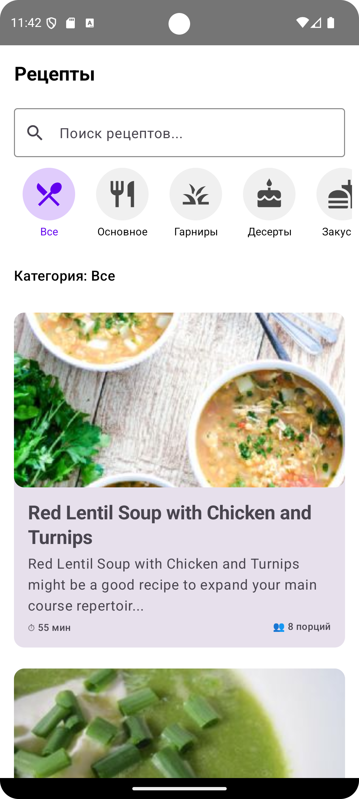
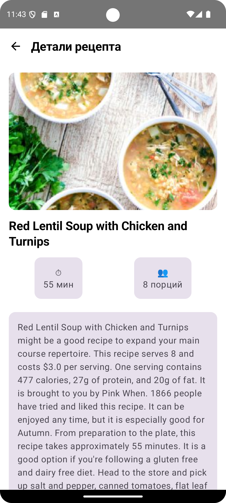

Приложение для поиска и просмотра рецептов с использованием [Spoonacular API](https://spoonacular.com/food-api). Приложение работает в режиме offline-first с кешированием данных и поддерживает пагинацию.

## 📱 Скриншоты

|            HomeScreen          |                RecipeDetailScreen           |           
| :----------------------------------:  | :---------------------------------------:|
|  |       | 

## ✨ Особенности

- **🔍 Поиск рецептов** - Поиск по названию с мгновенными результатами
- **📚 Категории рецептов** - 12 различных категорий (основные блюда, десерты, супы и т.д.)
- **📖 Пагинация** - Плавная загрузка рецептов с поддержкой бесконечного скролла
- **💾 Оффлайн-режим** - Работа без интернета с использованием кешированных данных
- **⭐ Закладки** - Возможность добавлять рецепты в избранное
- **🎨 Material Design 3** - Современный UI с темной темой

## 🏗️ Архитектура

Приложение построено по принципам **Clean Architecture** и **MVVM**:
📱 Presentation Layer (UI)
├── Compose Views
└── ViewModels

🎯 Domain Layer (Business Logic)
├── Use Cases
├── Repository Interface
└── Domain Models

💾 Data Layer (Data Sources)
├── Repository Implementation
├── Room Database (Local)
└── Retrofit (Remote API)

## 🛠️ Технологии

### Основные технологии:
- **Kotlin** - Язык программирования
- **Jetpack Compose** - Modern UI toolkit
- **Coroutines & Flow** - Асинхронное программирование
- **Dagger Hilt** - Dependency Injection

### База данных:
- **Room** - Локальная база данных
- **Paging 3** - Пагинация данных

### Сетевое взаимодействие:
- **Retrofit** - HTTP клиент
- **Moshi** - Парсинг JSON
- **Coil** - Загрузка изображений

### Архитектурные компоненты:
- **ViewModel** - Управление состоянием UI
- **Navigation Compose** - Навигация между экранами
- **DataStore** - Хранение настроек

## 📁 Структура проекта
app/
├── data/
│ ├── local/ # Room database и DAO
│ ├── remote/ # Retrofit API и DTOs
│ └── repository/ # Реализация репозитория
├── domain/
│ ├── model/ # Domain models
│ ├── repository/ # Интерфейсы репозиториев
│ └── usecase/ # Use cases
└── presentation/
├── screen/ # Composable экраны
├── component/ # Reusable UI компоненты
├── viewmodel/ # ViewModels
└── navigation/ # Навигация
